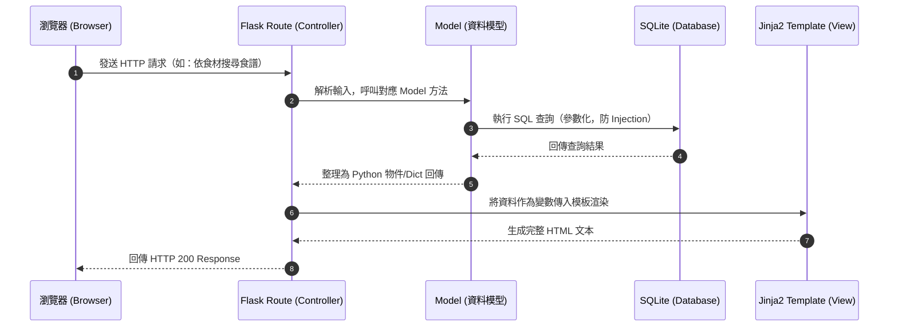
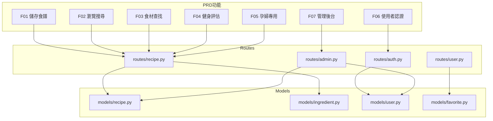

# 系統架構文件 — 食譜收藏系統

> 版本：v1.1　　最後更新：2026-05-07　　對應 PRD：v1.1

---

## 1. 技術架構說明

本系統採用傳統的 **MVC（Model-View-Controller）** 設計模式，頁面由後端統一渲染後回傳給瀏覽器，不需要前後端分離。這樣的架構有利於快速開發，特別適合將核心焦點放在資料呈現的網頁應用。

### 選用技術與原因

| 技術 | 選用原因 |
|------|----------|
| **Python + Flask** | 輕量級後端框架，不強制規定專案結構，開發者彈性大，適合快速開發中小型專案 |
| **Jinja2** | Flask 內建模板引擎，能方便將 Python 變數與邏輯動態渲染到 HTML，直接呈現頁面 |
| **SQLite** | 無需架設獨立資料庫伺服器，資料直接儲存在本地檔案，輕量且完美符合 MVP 需求 |
| **HTML5 + CSS3 + 原生 JS** | 無需引入前端框架，降低複雜度，聚焦後端資料邏輯 |
| **werkzeug.security** | Flask 內建密碼雜湊工具，保護使用者帳號安全，不以明文儲存密碼 |

### Flask MVC 模式說明

```
Model（模型）           → app/models/
  負責定義資料結構、與 SQLite 溝通，執行所有 SQL 查詢

View（視圖）            → app/templates/
  負責呈現畫面，Jinja2 HTML 模板只管「顯示資料」，不包含商業邏輯

Controller（控制器）    → app/routes/
  負責接收瀏覽器 HTTP 請求，呼叫 Model 取得資料，再交給 View 渲染
```

---

## 2. 專案資料夾結構

```text
web_app_development/
├── app/                              # 應用程式主資料夾
│   ├── __init__.py                   # 初始化 Flask app、註冊 Blueprints
│   │
│   ├── models/                       # [Model] 資料庫模型與操作邏輯
│   │   ├── __init__.py
│   │   ├── database.py               # 資料庫連線與初始化工具
│   │   ├── user.py                   # 使用者模型（帳號、密碼雜湊、角色）
│   │   ├── recipe.py                 # 食譜模型（含難度、分類、營養素、孕婦標示）
│   │   ├── ingredient.py             # 食材模型（多對多關聯食譜）
│   │   └── favorite.py               # 使用者收藏模型
│   │
│   ├── routes/                       # [Controller] Flask 路由（Blueprints）
│   │   ├── __init__.py
│   │   ├── auth.py                   # 身分驗證（註冊/登入/登出）
│   │   ├── recipe.py                 # 食譜瀏覽、搜尋、食材查找、新增/編輯
│   │   ├── user.py                   # 使用者個人頁面、收藏管理
│   │   └── admin.py                  # 後台管理員專屬功能
│   │
│   ├── templates/                    # [View] Jinja2 HTML 模板
│   │   ├── base.html                 # 全站共用基礎佈局（Navbar、Footer）
│   │   ├── auth/
│   │   │   ├── login.html            # 登入頁
│   │   │   └── register.html         # 註冊頁
│   │   ├── recipe/
│   │   │   ├── index.html            # 食譜首頁（熱門食譜列表）
│   │   │   ├── search.html           # 關鍵字/食材搜尋結果頁
│   │   │   ├── detail.html           # 食譜詳情頁（含營養標示）
│   │   │   └── form.html             # 新增/編輯食譜表單頁
│   │   ├── user/
│   │   │   └── favorites.html        # 我的收藏頁
│   │   ├── admin/
│   │   │   ├── dashboard.html        # 管理員後台首頁
│   │   │   ├── recipes.html          # 管理食譜列表（含審核狀態）
│   │   │   └── users.html            # 管理使用者列表
│   │   └── errors/
│   │       ├── 404.html              # 找不到頁面
│   │       └── 403.html              # 無權限頁面
│   │
│   └── static/                       # 靜態資源
│       ├── css/
│       │   └── style.css             # 全站樣式與設計系統
│       ├── js/
│       │   └── main.js               # 前端互動（動態食材標籤輸入等）
│       └── images/                   # 平台圖片（預設封面、圖示等）
│
├── instance/                         # 不進入版控的私密環境資料
│   └── database.db                   # SQLite 資料庫檔案
│
├── database/
│   └── schema.sql                    # 資料庫建表 SQL 腳本
│
├── docs/                             # 開發文件
│   ├── PRD.md                        # 產品需求文件
│   ├── ARCHITECTURE.md               # 本文件
│   ├── DB_DESIGN.md                  # 資料庫設計
│   ├── FLOWCHART.md                  # 流程圖
│   └── ROUTES.md                     # 路由規劃
│
├── .env.example                      # 環境變數範本（SECRET_KEY 等）
├── .gitignore                        # Git 忽略清單（含 instance/、.env）
├── requirements.txt                  # Python 依賴套件
└── app.py                            # 系統入口，初始化 Flask 並啟動應用
```

---

## 3. 元件關係圖

### 3.1 一般請求資料流



### 3.2 功能與模組對應關係



---

## 4. 關鍵設計決策

### 決策 1：使用 Flask Blueprints 分割路由

為避免 `app.py` 隨功能增加而膨脹，將路由依功能分類拆分至 `routes/` 資料夾，分為：
- `auth.py`：身分驗證（登入/註冊/登出）
- `recipe.py`：食譜 CRUD、搜尋、食材查找、健身與孕婦篩選
- `admin.py`：管理員後台（審核、管理）
- `user.py`：使用者個人資料與收藏

這樣有助於團隊分工、各自開發不同頁面，後續擴充也不影響彼此。

---

### 決策 2：食材採多對多關聯設計（支援 F03 食材查找）

「從食材找食譜」是本系統的核心亮點，需要「一個食譜包含多種食材、一種食材出現在多種食譜」的多對多關聯。

設計上透過 `recipe_ingredient`（中間表）連結 `recipes` 與 `ingredients`，查詢「包含特定食材集合」的食譜時，可用 SQL `GROUP BY + HAVING COUNT` 高效完成，避免全表掃描。

---

### 決策 3：密碼安全雜湊（支援 F06 使用者認證）

即使使用輕量的 SQLite，使用者密碼仍採用 `werkzeug.security` 的 `generate_password_hash` / `check_password_hash` 進行雜湊，絕不以明文儲存。Session 管理透過 Flask 內建 `session`（搭配 `SECRET_KEY` 加密）。

---

### 決策 4：食譜加入族群專用欄位（支援 F04、F05）

為支援健身者與孕婦的專屬功能，`recipes` 資料表加入以下欄位：
- **營養素欄位**：`calories`、`protein`、`fat`、`carbs`（支援 F04）
- **健身目標標籤**：`fitness_tag`（增肌/減脂/維持）
- **孕婦安全標示**：`pregnancy_safe`（布林值）、`pregnancy_stage`（孕期階段）
- **禁忌食材警示**：在 `ingredients` 表加 `is_pregnancy_warning` 欄位

這樣不需要額外建立子系統，即可在現有 `recipe.py` 路由中篩選，保持架構簡單。

---

### 決策 5：精簡前端，聚焦後端邏輯

前端只使用無框架的 HTML / CSS / 原生 JavaScript，不引入 React、Vue 等大型框架。需要動態互動的地方（如食材標籤輸入、即時篩選）只透過簡單的 DOM 操作完成，降低學習成本與編譯複雜度，讓團隊專注於後端資料邏輯。

---

## 5. 安全設計摘要

| 威脅 | 防護措施 |
|------|----------|
| SQL Injection | 所有 SQL 查詢使用參數化查詢（`?` 佔位符） |
| XSS 攻擊 | Jinja2 預設自動 escape 輸出內容 |
| 未授權存取後台 | 每個 admin 路由檢查 `session['role'] == 'admin'` |
| 密碼外洩 | `werkzeug` bcrypt 雜湊，不儲存明文 |
| 惡意檔案上傳 | 驗證副檔名白名單（jpg/png/webp），限制 5MB |
| SECRET_KEY 外洩 | 存於 `.env`，加入 `.gitignore` 不進版控 |
