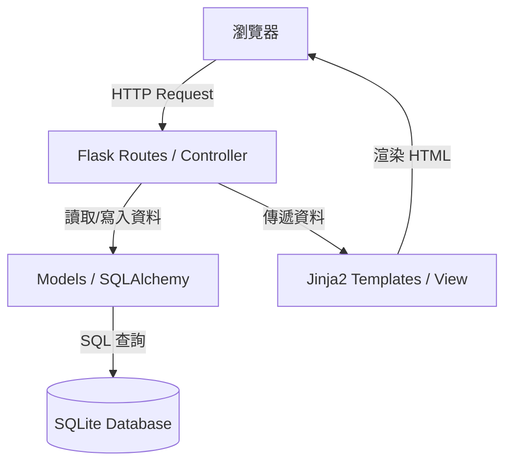

# 微型圖書館 (Mini Library) 系統架構文件

## 1. 技術架構說明

本專案採用經典的 **MVC (Model-View-Controller)** 模式進行開發，確保程式碼結構清晰且易於維護。

### 選用技術與原因
- **後端 (Controller)**: **Python + Flask**
  - 原因：輕量級框架，適合快速開發中小型系統。
- **模板引擎 (View)**: **Jinja2**
  - 原因：Flask 內建支援，能直接在 HTML 中嵌入 Python 變數與邏輯，適合傳統伺服器渲染 (SSR) 應用。
- **資料庫 (Model)**: **SQLite**
  - 原因：無需額外安裝資料庫伺服器，單一檔案即可儲存，非常適合「微型」圖書館系統。
- **前端樣式**: **Vanilla CSS (原生 CSS)**
  - 原因：保持專案簡潔，無需依賴繁重的 CSS 框架。

### MVC 模式說明
- **Model (模型)**: 負責與 SQLite 資料庫互動，定義書籍、使用者及借閱紀錄的資料結構。
- **View (視圖)**: 使用 Jinja2 編寫的 HTML 模板，負責呈現介面給使用者。
- **Controller (控制器)**: Flask 的路由函式 (Routes)，負責處理 HTTP 請求、執行商業邏輯並決定呈現哪個 View。

---

## 2. 專案資料夾結構

```text
web_app_development/
├── app/
│   ├── models/           # 資料庫模型 (Model)
│   │   └── __init__.py
│   ├── routes/           # Flask 路由 (Controller)
│   │   └── __init__.py
│   ├── static/           # 靜態資源
│   │   ├── css/          # 樣式檔 (index.css)
│   │   └── js/           # 指令碼 (main.js)
│   ├── templates/        # Jinja2 HTML 模板 (View)
│   │   ├── base.html     # 基礎佈局
│   │   ├── index.html    # 首頁 (圖書搜尋)
│   │   ├── login.html    # 登入頁
│   │   ├── dashboard.html # 管理後台/個人中心
│   │   └── book_detail.html # 書籍詳情
│   └── __init__.py       # 初始化 Flask App 與資料庫
├── docs/                 # 專案文件 (PRD, Architecture)
├── instance/             # 實例資料夾 (不進 Git，儲存資料庫檔案)
│   └── library.db        # SQLite 資料庫檔案
├── .gitignore            # 忽略不需要上傳的檔案 (如 instance/ 內容)
├── app.py                # 系統入口點
└── requirements.txt      # 專案套件清單
```

---

## 3. 元件關係圖

### 資料流與處理邏輯


---

## 4. 關鍵設計決策

1.  **單一資料庫檔案 (SQLite)**: 為了維持系統的「微型」與「易遷移性」，選擇 SQLite。這讓管理者可以輕鬆備份資料庫（只需複製檔案）。
2.  **伺服器端渲染 (SSR)**: 選擇 Flask + Jinja2 而非前後端分離 (SPA)。這能減少前端開發複雜度，並確保首頁載入速度。
3.  **基礎權限區分**: 在 Flask 路由中使用簡單的 Session 判斷。雖然系統微型，但仍需區分「借閱者」與「管理員」的操作權限（例如：只有管理員能刪除書籍）。
4.  **模組化路由**: 將路由拆分到 `app/routes/` 下的不同模組（如 `auth.py`, `books.py`），避免單一檔案過於龐大，提升後續擴充性。
5.  **基礎佈局繼承**: 使用 Jinja2 的 ``。這能確保所有頁面的導航欄與頁尾風格一致，減少重複程式碼。

---

## 5. 後續步驟建議

1.  **流程設計**: 使用 `/flowchart` 繪製使用者借還書的詳細流程。
2.  **資料庫設計**: 使用 `/db-design` 定義 Table Schema（書籍表、用戶表、借閱紀錄表）。
