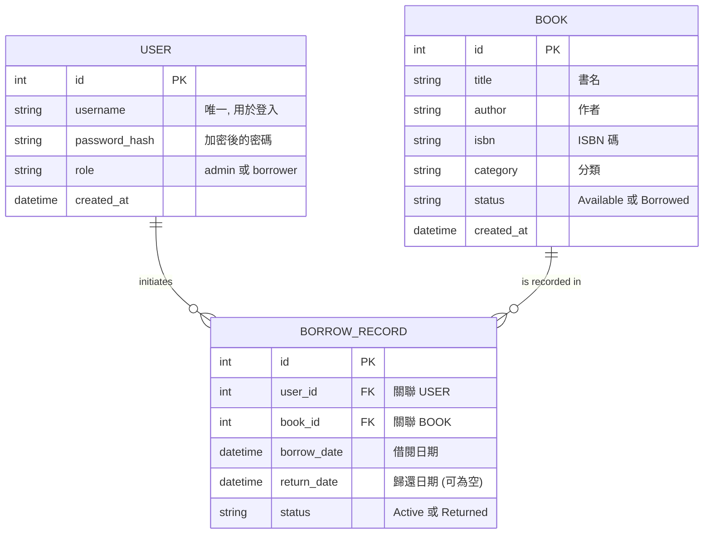

# 微型圖書館 (Mini Library) 資料庫設計文件

## 1. ER 圖 (Entity Relationship Diagram)

本系統包含三個核心實體：使用者 (User)、書籍 (Book) 與 借閱紀錄 (BorrowRecord)。

---

## 2. 資料表詳細說明

### 2.1 USER (使用者表)
| 欄位 | 型別 | 說明 | 必填 | 備註 |
| :--- | :--- | :--- | :--- | :--- |
| id | INTEGER | 流水編號 | 是 | PRIMARY KEY |
| username | TEXT | 使用者名稱 | 是 | UNIQUE |
| password_hash| TEXT | 雜湊密碼 | 是 | |
| role | TEXT | 角色權限 | 是 | admin/borrower |
| created_at | DATETIME | 建立時間 | 是 | DEFAULT CURRENT_TIMESTAMP |

### 2.2 BOOK (書籍表)
| 欄位 | 型別 | 說明 | 必填 | 備註 |
| :--- | :--- | :--- | :--- | :--- |
| id | INTEGER | 流水編號 | 是 | PRIMARY KEY |
| title | TEXT | 書名 | 是 | |
| author | TEXT | 作者 | 否 | |
| isbn | TEXT | ISBN 碼 | 否 | |
| category | TEXT | 分類 | 否 | |
| status | TEXT | 狀態 | 是 | Available/Borrowed |
| created_at | DATETIME | 建立時間 | 是 | DEFAULT CURRENT_TIMESTAMP |

### 2.3 BORROW_RECORD (借閱紀錄表)
| 欄位 | 型別 | 說明 | 必填 | 備註 |
| :--- | :--- | :--- | :--- | :--- |
| id | INTEGER | 流水編號 | 是 | PRIMARY KEY |
| user_id | INTEGER | 使用者 ID | 是 | FOREIGN KEY (users.id) |
| book_id | INTEGER | 書籍 ID | 是 | FOREIGN KEY (books.id) |
| borrow_date | DATETIME | 借閱時間 | 是 | DEFAULT CURRENT_TIMESTAMP |
| return_date | DATETIME | 歸還時間 | 否 | |
| status | TEXT | 紀錄狀態 | 是 | Active/Returned |

---

## 3. 關鍵設計選擇
- **密碼安全**: 使用 `password_hash` 儲存，不存明碼。
- **狀態管理**: 書籍狀態由 `BOOK.status` 直接記錄以便快速查詢；詳細歷史則由 `BORROW_RECORD` 追蹤。
- **擴充性**: `role` 欄位採字串設計，未來可視需求增加 `superadmin` 或 `editor` 等角色。
