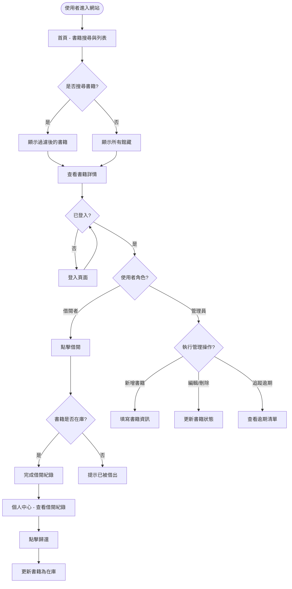
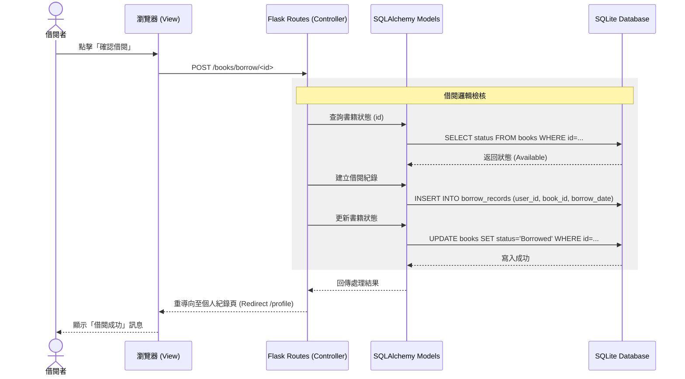

# 微型圖書館 (Mini Library) 流程圖文件

## 1. 使用者流程圖 (User Flow)

描述使用者進入系統後，如何進行書籍搜尋、借閱、歸還以及管理操作。

---

## 2. 系統序列圖 (Sequence Diagram)

以「借書流程」為例，描述資料如何在各元件之間流動。

---

## 3. 功能清單對照表

以下是系統各功能對應的 URL 路徑與 HTTP 方法規劃：

| 功能名稱 | URL 路徑 | HTTP 方法 | 說明 |
| :--- | :--- | :--- | :--- |
| **首頁/書籍搜尋** | `/` | `GET` | 顯示書籍列表與搜尋介面 |
| **書籍詳情** | `/book/<int:id>` | `GET` | 查看特定書籍的詳細資訊 |
| **登入** | `/login` | `GET`, `POST` | 使用者與管理員登入 |
| **登出** | `/logout` | `GET` | 登出當前帳號 |
| **執行借書** | `/book/borrow/<int:id>` | `POST` | 建立借閱紀錄並更新書籍狀態 |
| **執行還書** | `/book/return/<int:id>` | `POST` | 更新借閱紀錄並將書籍標記為在庫 |
| **個人中心** | `/profile` | `GET` | 查看個人借閱歷史與當前借閱 |
| **管理後台** | `/admin/dashboard` | `GET` | 管理員概覽（含逾期統計） |
| **新增書籍** | `/admin/book/add` | `GET`, `POST` | 管理員手動新增圖書 |
| **編輯書籍** | `/admin/book/edit/<int:id>`| `GET`, `POST` | 修改書籍基本資訊 |
| **刪除書籍** | `/admin/book/delete/<int:id>`| `POST` | 從館藏中移除書籍 |
| **逾期清單** | `/admin/overdue` | `GET` | 篩選出所有已逾期的借閱紀錄 |

---

**後續步驟建議：**
流程設計已完成，您可以輸入 `/db-design` 來設計具體的資料庫 Table Schema。
