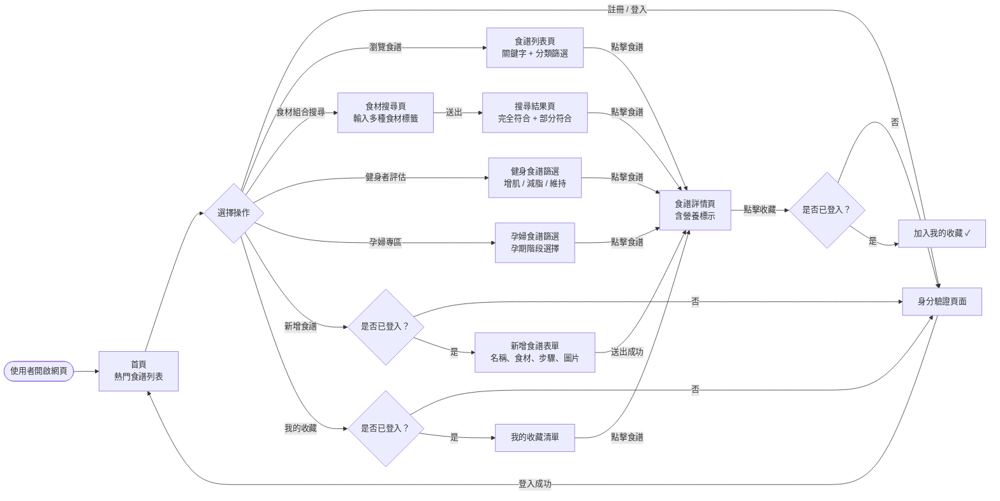
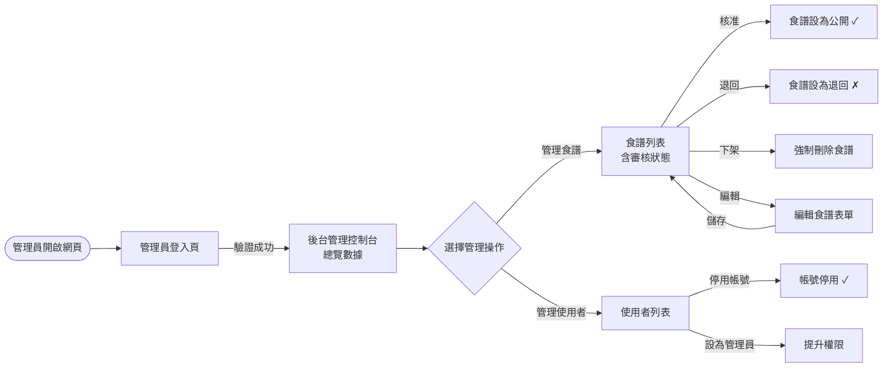
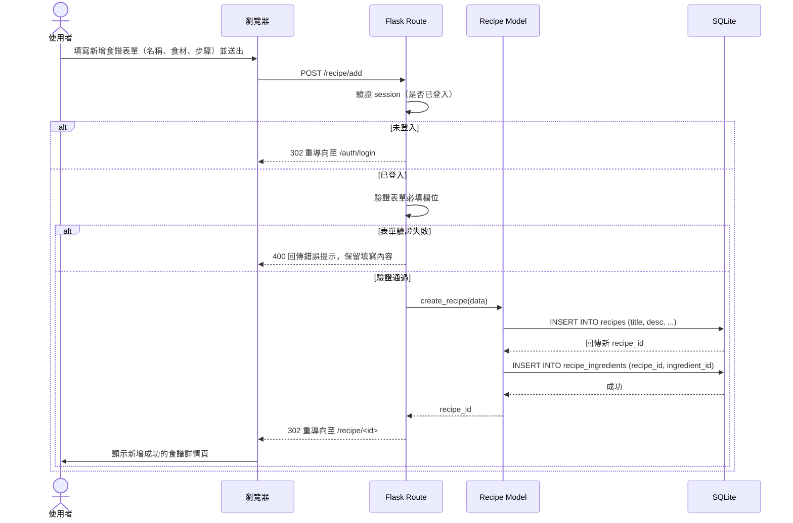
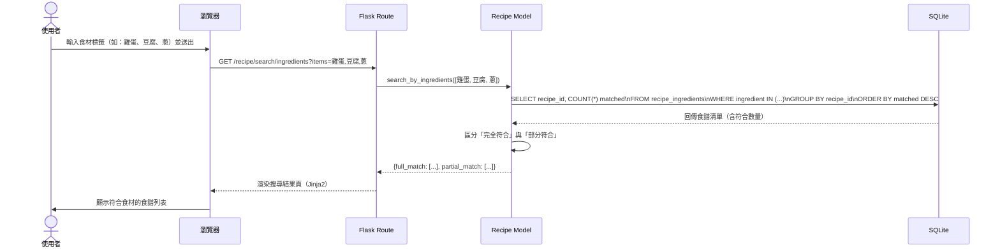
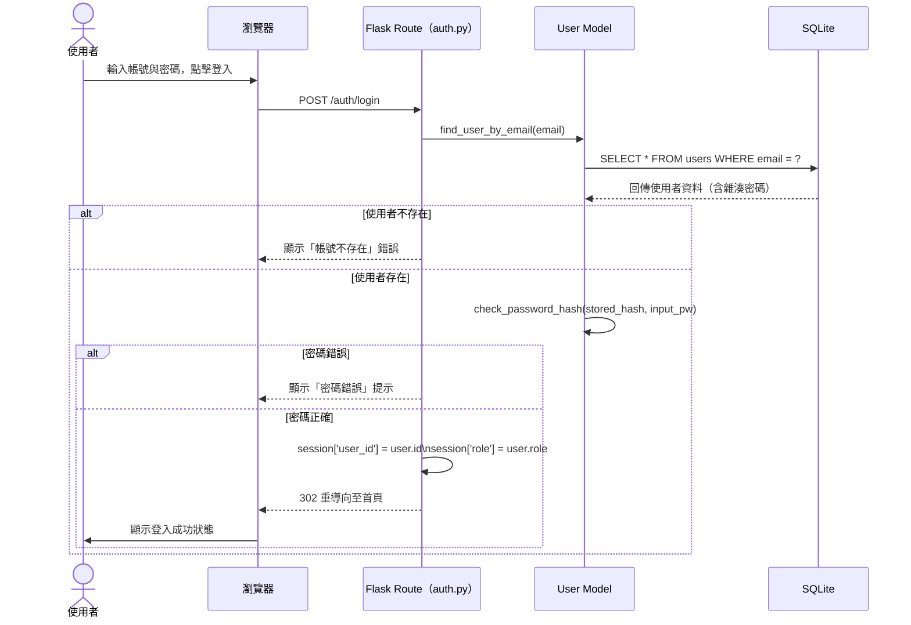
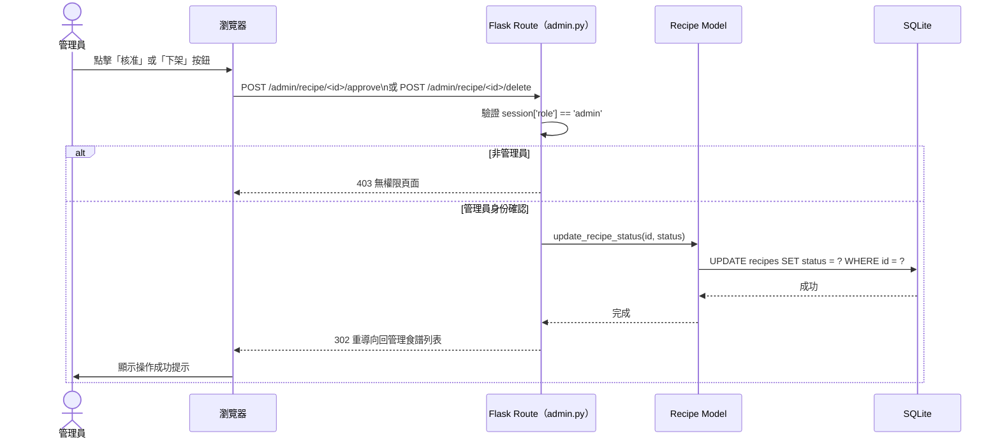

# 流程圖文件 — 食譜收藏系統

> 版本：v1.1　　最後更新：2026-05-07　　對應 PRD：v1.1

本文件基於 PRD 與系統架構設計，使用 Mermaid 語法繪製使用者操作流程圖及系統資料處理序列圖。

---

## 1. 使用者流程圖（User Flow）

### 1.1 一般使用者主流程

從使用者進入網站開始，涵蓋所有主要功能的完整操作路徑。

---

### 1.2 管理員操作流程

---

## 2. 系統序列圖（Sequence Diagram）

### 2.1 使用者新增食譜流程

---

### 2.2 食材組合搜尋食譜流程

---

### 2.3 使用者登入驗證流程

---

### 2.4 管理員審核食譜流程

---

## 3. 功能清單對照表

| 功能描述 | URL 路徑 | HTTP 方法 | 對應 Blueprint | 說明 |
|----------|----------|-----------|----------------|------|
| 首頁（熱門食譜） | `/` | GET | recipe | 呈現首頁與推薦食譜 |
| 食譜列表 + 關鍵字搜尋 | `/recipe/` | GET | recipe | 支援 `?q=` 關鍵字與分類篩選 |
| 食材組合搜尋 | `/recipe/search/ingredients` | GET | recipe | 多食材標籤輸入，回傳符合清單 |
| 健身食譜篩選 | `/recipe/fitness` | GET | recipe | 依 `?goal=` 篩選增肌/減脂/維持 |
| 孕婦食譜篩選 | `/recipe/pregnancy` | GET | recipe | 依孕期階段篩選安全食譜 |
| 食譜詳情頁 | `/recipe/<int:id>` | GET | recipe | 顯示食譜內容與完整營養標示 |
| 新增食譜（表單） | `/recipe/add` | GET | recipe | 顯示新增表單（需登入） |
| 處理新增食譜 | `/recipe/add` | POST | recipe | 驗證並寫入 DB，含食材關聯 |
| 編輯食譜（表單） | `/recipe/<int:id>/edit` | GET | recipe | 顯示編輯表單（限本人或管理員） |
| 處理編輯食譜 | `/recipe/<int:id>/edit` | POST | recipe | 更新 DB 資料 |
| 刪除食譜 | `/recipe/<int:id>/delete` | POST | recipe | 刪除食譜（限本人或管理員） |
| 收藏/取消收藏 | `/recipe/<int:id>/favorite` | POST | recipe | 操作 favorites 關聯資料 |
| 我的收藏清單 | `/user/favorites` | GET | user | 顯示已收藏食譜清單（需登入） |
| 使用者個人頁面 | `/user/profile` | GET | user | 顯示個人資訊與已發布食譜 |
| 註冊頁面 | `/auth/register` | GET | auth | 顯示註冊表單 |
| 處理註冊 | `/auth/register` | POST | auth | 驗證欄位、雜湊密碼、建立帳號 |
| 登入頁面 | `/auth/login` | GET | auth | 顯示登入表單 |
| 處理登入 | `/auth/login` | POST | auth | 驗證密碼、建立 Session |
| 登出 | `/auth/logout` | GET | auth | 清除 Session，重導向首頁 |
| 後台控制台 | `/admin/` | GET | admin | 數據總覽（需管理員權限） |
| 後台食譜管理 | `/admin/recipes` | GET | admin | 所有食譜列表與審核狀態 |
| 核准食譜 | `/admin/recipe/<int:id>/approve` | POST | admin | 設定食譜狀態為公開 |
| 下架/刪除食譜 | `/admin/recipe/<int:id>/delete` | POST | admin | 強制刪除違規食譜 |
| 後台使用者管理 | `/admin/users` | GET | admin | 所有使用者列表 |
| 停用使用者帳號 | `/admin/user/<int:id>/disable` | POST | admin | 停用指定帳號 |
